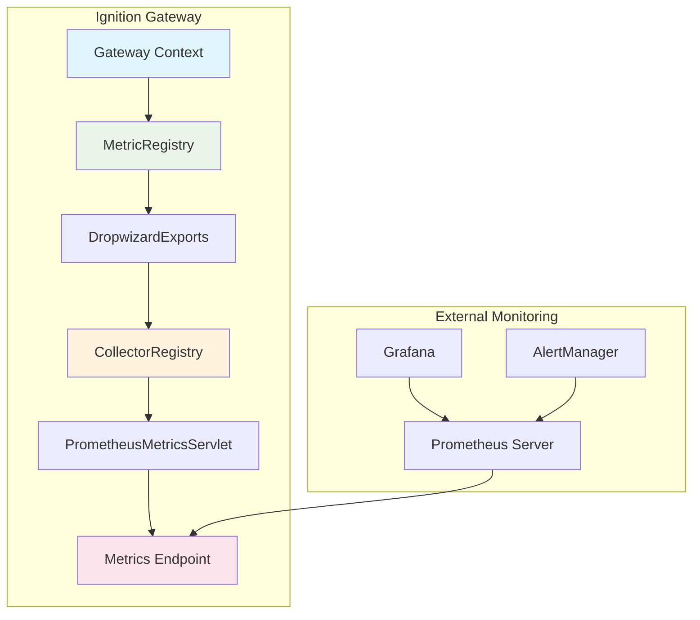
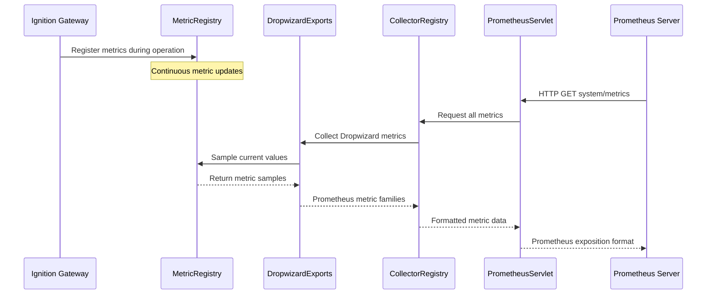
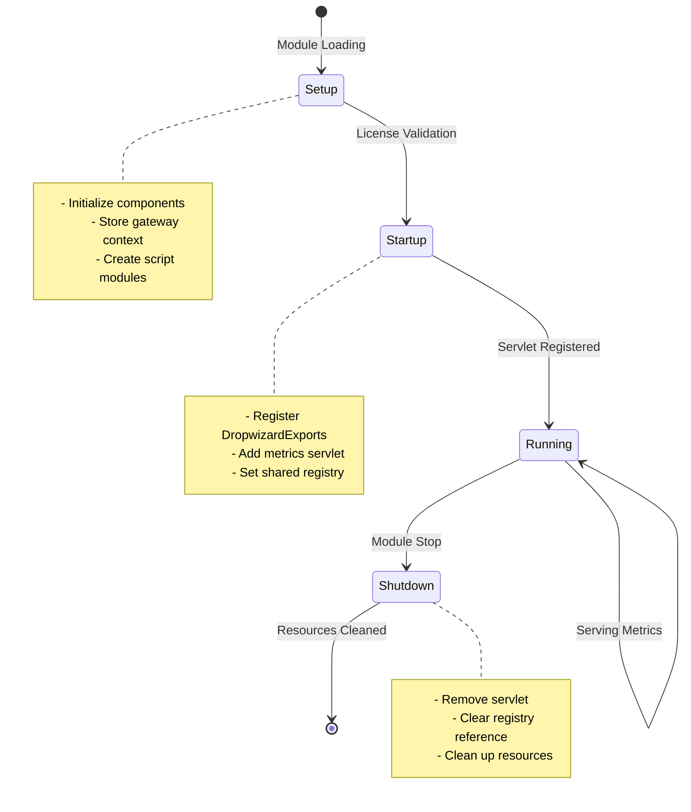

# Architecture

The Prometheus Exporter Module follows a clean, modular architecture that integrates seamlessly with Ignition's existing infrastructure while maintaining separation of concerns.

## High-Level Architecture



## Core Components

### Gateway Hook (`PrometheusExporterGatewayHook`)

The main entry point for the module, extending Ignition's `AbstractGatewayModuleHook`:

- **Lifecycle Management**: Handles module startup, shutdown, and configuration
- **Servlet Registration**: Registers the metrics servlet at `/system/metrics`
- **Registry Management**: Connects Ignition's MetricRegistry to Prometheus CollectorRegistry
- **Script Module Integration**: Provides gateway-scoped scripting functions

```java
// Key initialization in startup()
MetricRegistry metricRegistry = context.getMetricRegistry();
collectorRegistry.register(new DropwizardExports(metricRegistry));
webResourceManager.addServlet(SERVLET_KEY, PrometheusMetricsServlet.class);
```

### Metrics Servlet (`PrometheusMetricsServlet`)

Lightweight HTTP servlet that serves metrics in Prometheus exposition format:

- **HTTP Endpoint**: Responds to GET requests at `/system/metrics`
- **Format Conversion**: Converts collected metrics to Prometheus text format
- **Registry Access**: Uses shared CollectorRegistry for thread-safe metric access
- **Standard Compliance**: Follows Prometheus HTTP API specifications

### Dropwizard Integration

The module leverages Ignition's existing Dropwizard MetricRegistry through the `DropwizardExports` collector:

- **Zero Configuration**: Automatically discovers all registered metrics
- **Performance Efficient**: No metric duplication or additional collection overhead
- **Type Preservation**: Maintains semantic meaning of different metric types
- **Label Support**: Properly handles metric dimensions and tags

## Data Flow

### Metric Collection Process



### Module Lifecycle



## Thread Safety and Concurrency

### Safe Metric Access

- **CollectorRegistry**: Thread-safe by design for concurrent metric collection
- **DropwizardExports**: Handles concurrent access to underlying MetricRegistry
- **Servlet**: Stateless design supports multiple simultaneous scrape requests
- **Shared Registry**: Uses static reference with proper initialization guards

### Performance Characteristics

- **Memory Impact**: Minimal - no metric duplication, reference-based access
- **CPU Overhead**: Low - metrics collected on-demand during scrape requests
- **Network**: Standard HTTP servlet with compression support
- **Scalability**: Handles multiple Prometheus servers scraping simultaneously

## Integration Points

### Ignition Platform Integration

- **Gateway Scope**: Module operates exclusively in gateway context
- **Web Server**: Uses Ignition's built-in Jetty web server
- **Security**: Inherits Ignition's web security and SSL configuration  
- **Logging**: Standard SLF4J integration with Ignition's logging system

### Prometheus Ecosystem Integration

- **Standard Format**: OpenMetrics/Prometheus exposition format
- **Discovery**: Compatible with Prometheus service discovery mechanisms
- **Federation**: Supports Prometheus federation for multi-gateway deployments
- **Tooling**: Works with standard Prometheus ecosystem tools (Grafana, AlertManager)

## Extension Points

### Custom Metrics (via Scripting)

The architecture supports custom metric registration through gateway scripts:

```python
# Example of custom metric registration
system.prometheus.counter("custom_operations_total") \
    .labels({"operation": "backup", "status": "success"}) \
    .increment()
```

### Future Enhancements

The modular design enables future capabilities:

- **Metric Filtering**: Selective metric exposure configuration
- **Custom Collectors**: Additional metric sources beyond Dropwizard
- **Authentication**: Enhanced security for metric endpoint access
- **Clustering**: Multi-gateway metric aggregation support